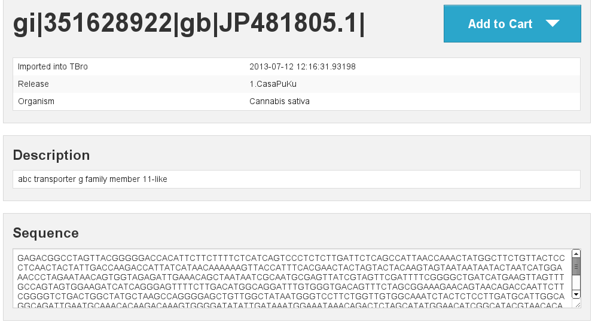
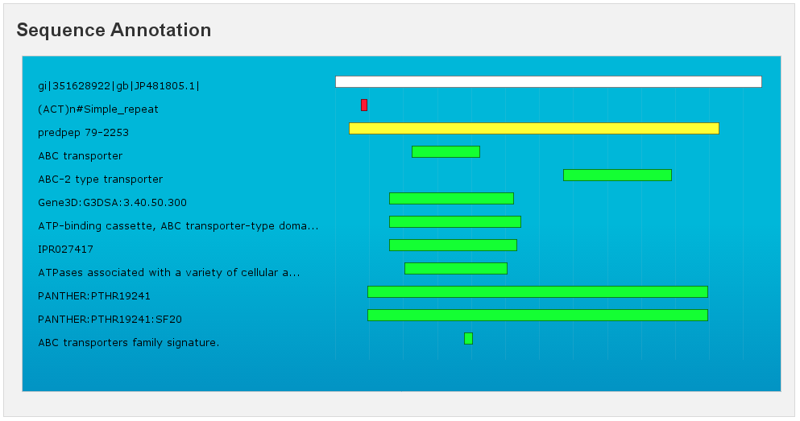
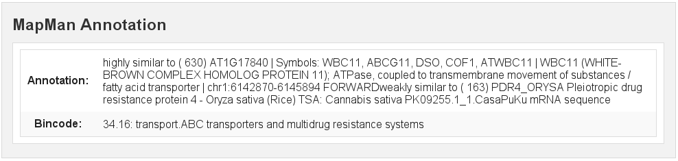
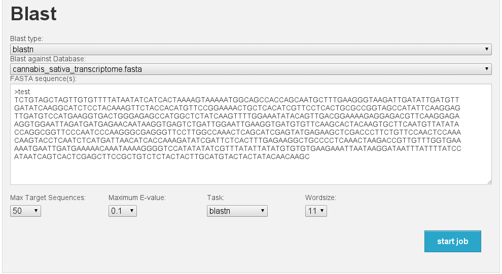
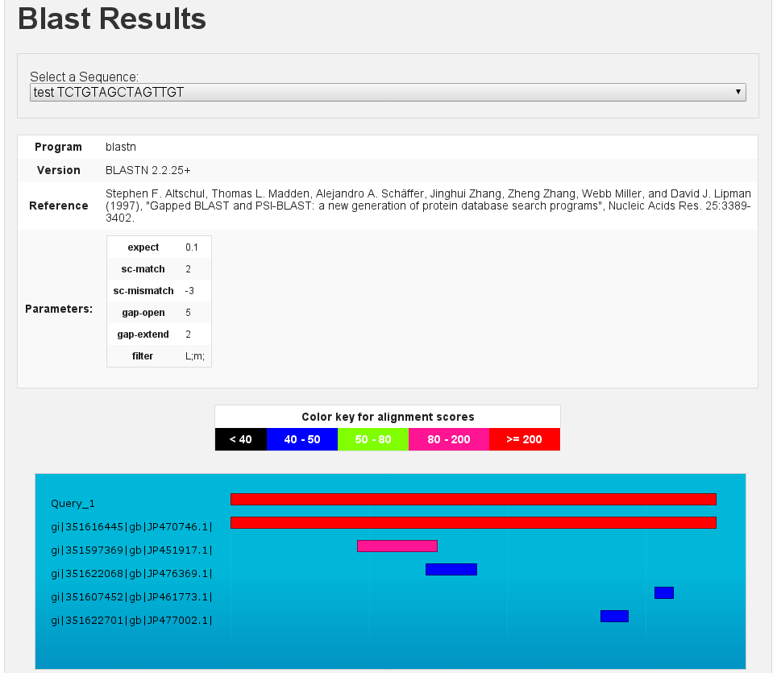

Introduction
============

The aim of this manual is to teach you how to use the TBro. At first you
will learn how to bring the data into the TBro. For this purpose you can
follow the step by step guide using example data. When you work through
this tutorial you have two options. You can either start from scratch,
load the data from the original sources and perform the analyses
yourself or you can just use the precomputed results in the example
directory. In the manual it is assumed that you perform the analyses
yourself so all commands that created the data are included. However the
scope of this manual is not to teach you how to perform transcriptomic
analyses and some of the methods may soon be out of date. The methods of
importing and interpreting the data however will remain the same. If you
choose to use the precomputed data just ignore all commands regarding
their creation and use the accordingly named files in the example
directory.

Data
====

The demo data consists of the published transcriptome of /Cannabis sativa/.
And additional short read libraries of different samples.

Cannabis sativa
---------------

The raw data is available through NCBI. The transcriptome is described
in @CSATIVA and has accession numbers (JP449145 - JP482359). Read data
from different samples is available through the SRA at NCBI. The used
samples are:

-  Mature flower (SRR306868, SRR306869, SRR306870)

-  Mature leaf (SRR306875, SRR306885, SRR306886)

-  Entire root (SRR306861, SRR306862, SRR306863)

We analyzed the data in different ways and final results for each
analysis are included in the example data. You can use this pregenerated
results or generate it yourself, for this purpose each command for data
creation along with program version is given. For an overview of the
used programs and versions see table [tab:PROGRAMS].

[tab:PROGRAMS]

+-------------------------------------------+-----------------------+---------------+
| Task                                      | Program               | Version       |
+===========================================+=======================+===============+
| Peptide prediction                        | Transdecoder          | r2012-08-15   |
+-------------------------------------------+-----------------------+---------------+
| Repeat annotation                         | RepeatMasker          | 4.0.3         |
+-------------------------------------------+-----------------------+---------------+
| General annotations                       | InterproScan          | 5 RC5         |
+-------------------------------------------+-----------------------+---------------+
| GO/EC annotation                          | Blast2GO (B2G4Pipe)   | 2.5.0         |
+-------------------------------------------+-----------------------+---------------+
| General annotation                        | MapMan (Mercator)     | 2013/07/18    |
+-------------------------------------------+-----------------------+---------------+
| Count quantification                      | RSEM                  | 1.2.5         |
+-------------------------------------------+-----------------------+---------------+
| Normalization / Differential expression   | DESeq                 | 1.12.1        |
+-------------------------------------------+-----------------------+---------------+

Data creation and import into TBro is described as a workflow in the
next section.

Bringing the data into TBro
===========================

For this tutorial it is assumed, that you have a fresh install of TBro
as described in the installation section.
All commands are executed inside the TBro_official docker container.
To enter this container do the following:

::
    docker exec -it TBro_official /bin/bash

Alternatively you can download the tbro-cli tools to your local machine.
But remember that you have to install them via phing and set the config.php properly (to point to the database in the docker container - find the ip via docker inspect)
No demo data has been loaded to the database yet.
These are the manual steps to load the demo data (resembling the automatic installation via TBro_demo docker container).
So lets start populating the database with our first transcriptome.

The Cannabis sativa transcriptome
---------------------------------

Preparation
~~~~~~~~~~~

There is one preparation necessary before we can start importing data
into TBro. We have to create the organism as is not part of the default
``CHADO`` repertoir.

::

    tbro-db organism insert --genus Cannabis --species sativa\
     --common_name Weed --abbreviation C.sativa
     
    tbro-db organism list

The last command shows us all organisms known to TBro. As we see the ID
of is 13. We will need this ID for later commands. You have probably
noticed that it is possible to use autocompletion for commands,
subcommands and parameters. In addition the very useful ``–help`` option
is present for every command and gives information on usage, and
available parameters.

The Transcripts
~~~~~~~~~~~~~~~

Create a directory `cannabis\_sativa <cannabis_sativa>`__ with
subdirectory `transcriptome <transcriptome>`__

::

    mkdir -p cannabis_sativa/transcriptome 
    cd cannabis_sativa/transcriptome

Download the transcriptome from ``NCBI`` [1]_. To do so, search for
``74271[BioProject]`` on http://www.ncbi.nlm.nih.gov/nuccore and
download all hits as fasta. There should be sequences. Save those to the
file
`cannabis\_sativa\_transcriptome.fasta <cannabis_sativa_transcriptome.fasta>`__
in the newly created folder. As we have no isoform unigene relationship
for those transcripts we treat all of them as separate isoforms. So the
id file comes down to a simple list of all ids in the fasta.

::

    grep ">" cannabis_sativa_transcriptome.fasta\
     | perl -pe 's/>(\S+).*/$1/'\
     >cannabis_sativa_transcriptome.ids

Now, it’s time to import the sequence IDs into TBro. As we have no
isoform - unigene relationship we import each transcript as a single
isoform:

::

    tbro-import sequence_ids --organism_id 13 --release 1.CasaPuKu\
     --file_type only_isoforms cannabis_sativa_transcriptome.ids

| We had to pass the previously given organism-id and a release name.
The release name can be selected freely and the release is automatically
created upon first usage. The file-type was set to ``only_isoforms`` as
we have no unigenes. Other possible values are ``only_unigenes`` and
``map``. The last thing we pass is the path to the file containing the
sequence-ids which we have just created.
| TBro now knows about the sequence ids so lets feed it with the
associated sequences:

::

    tbro-import sequences_fasta --organism_id 13\
     --release 1.CasaPuKu cannabis_sativa_transcriptome.fasta

Now it’s time to start up your browser and visit your TBro instance. Use
the quick search field in the upper right corner to find
``gi|351628922|gb|JP481805.1|``. You will see the isoform page with the
basic information about this transcript. By now there is just the
general info (date of import, organism, release) and the sequence
together with a visualization as a horizontal bar. You can check back to
this page after every successful import to watch how the new features
are presentet. Of course you can choose any other isoform that is of
interest to you.

Predicted Peptides
~~~~~~~~~~~~~~~~~~

After we have the nucleotide sequences, the next step is to predict
peptides and load this info into TBro. There are many tools available to
predict peptides, we chose ``Transdecoder`` but the TBro does not
restrict you to a certain tool.

::

    mkdir -p ../peptids
    cd ../peptids

    transcripts_to_best_scoring_ORFs.pl -t \
     ../transcriptome/cannabis_sativa_transcriptome.fasta\
     -m 30 -v --CPU 4 >log >error.log

Note that we have set the minimum protein length to 30 and number of
threads to 4, you can adjust those parameters to your own requirements.
Unfortunatelly the output format for predicted peptides is not
standardized. To make the peptide import generic and not rely on the
output format of a special program the import into TBro is split into
two steps. First a list of peptides is imported. This list has to be in
tab delimited format and contain the following columns:

1. peptide id

2. isoform id

3. start position

4. end position

5. strand (+/-)

This file can easily be created from the output of every peptide
prediction program. TBro contains a tool to get the table from the
``Transdecoder`` output so lets use that:

::

    tbro-tools transToProt -o predicted_peptides.tbl\
     best_candidates.eclipsed_orfs_removed.pep

Lets have a look to see that the table has the desired format.

::

    head -n5 predicted_peptides.tbl
    m.243266        gi|351590686|gb|JP449145.1|     165     893     +
    m.243259        gi|351590687|gb|JP449146.1|     1751    1894    +
    m.243253        gi|351590687|gb|JP449146.1|     2       1684    +
    m.243237        gi|351590688|gb|JP449147.1|     1       1986    +
    m.243247        gi|351590688|gb|JP449147.1|     2173    2295    +

Now to import this peptide table issue the following command:

::

    tbro-import peptide_ids --organism_id 13\
     --release 1.CasaPuKu predicted_peptides.tbl

TBro now knows about the predicted peptides and their locations. What’s
missing is the sequences. They are added the same way as the nucleotide
sequences of the transcripts before. It is important, that the fasta IDs
exactly match the IDs in the first column of the peptide table.

::

    tbro-import sequences_fasta --organism_id 13\
     --release 1.CasaPuKu best_candidates.eclipsed_orfs_removed.pep

You might want to check back to the web interface to see our newly
imported peptides.

RepeatMasker
~~~~~~~~~~~~

Another basic type of annotation are repeats. So we create repeat
annotations using ``RepeatMasker`` and import them.

::

    mkdir -p ../analyses/repeats
    cd ../analyses/repeats

    RepeatMasker -pa 4 -dir . -xm -species viridiplantae\
     ../../transcriptome/cannabis_sativa_transcriptome.fasta

All we need to do now is tell TBro to import the generated file as
``RepeatMasker`` annotations:

::

    tbro-import annotation_repeatmasker --organism_id 13\
     --release 1.CasaPuKu cannabis_sativa_transcriptome.fasta.out.xm

Interpro
~~~~~~~~

``Interpro`` is a usefull tool to annotate protein sequences with
information from different databases. There exists a command line
version of this tool called ``InterproScan``. We use this tool to
generate the interpro annotations for our transcriptome:

::

    mkdir -p ../interpro
    cd ../interpro

    interproscan.sh --pa --iprlookup --goterms --fasta\
     ../../peptids/best_candidates.eclipsed_orfs_removed.pep\
     --output-file-base interpro >interpro.log

The results in the tsv format can be importet into TBro with the
following command:

::

    tbro-import annotation_interpro --organism_id 13\
     --release 1.CasaPuKu -i interproscan-5-RC5 interpro.tsv

Note that it is important to know the ``InterproScan`` version used as
each version uses different versions of the underlying databases.
Interpretation of the results requires knowledge of this versions so the
``-i`` switch taking the version is required for this import.

Blast2GO
~~~~~~~~

``Blast2GO`` uses ``BLAST`` to find sequence similarities to annotated
sequences. The hits are then used to assign GO terms and EC numbers to
the input sequences.

::

    mkdir -p ../blast2go
    cd ../blast2go

    blastx -query ../../transcriptome/cannabis_sativa_transcriptome.fasta\ 
     -db /path/to/databases/NCBI/nr -evalue 1e-3 -outfmt 5\ 
     -num_alignments 250 -num_descriptions 250\
     -out cannabis_sativa_transcriptome.nr.xml\
     2> cannabis_sativa_transcriptome.nr.log

    java -Xmx20G -cp *:ext/*: es.blast2go.prog.B2GAnnotPipe\
     -in cannabis_sativa_transcriptome.nr.xml\
     -out cannabis_sativa_transcriptome.blast2go.annot\
     -prop b2gPipe.properties -v -annot -dat -img\
     > cannabis_sativa_transcriptome.blast2go.log

First all sequences are blasted against a local copy of ``nr``. The
output format is set to 5 (xml output). The e-value cutoff was set to
:math:`10^{-3}`. Afterwards the ``BLAST`` output is passed to the
``Blast2GO`` annotation pipeline. We can extract three different kinds
of annotations from the ``Blast2GO`` output:

GO
^^

Gene Ontology

::

    grep "GO:" cannabis_sativa_transcriptome.blast2go.annot\
     >cannabis_sativa_transcriptome.blast2go.annot.go

    tbro-import annotation_go --organism_id 13\
     --release 1.CasaPuKu cannabis_sativa_transcriptome.blast2go.annot.go

The lines containing “GO:” are selected and imported into TBro as
annotation\_go

EC
^^

Enzyme Commission

::

    grep "EC:" cannabis_sativa_transcriptome.blast2go.annot\
     >cannabis_sativa_transcriptome.blast2go.annot.ec

    tbro-import annotation_ec --organism_id 13\
     --release 1.CasaPuKu cannabis_sativa_transcriptome.blast2go.annot.ec

The lines containing “EC:” are selected and imported into TBro as
annotation\_ec

Description
^^^^^^^^^^^

::

    perl -ane 'print if(@F>2)'\
     cannabis_sativa_transcriptome.blast2go.annot.go\
     >cannabis_sativa_transcriptome.blast2go.annot.go.description

    tbro-import annotation_description --organism_id 13 --release 1.CasaPuKu\
     cannabis_sativa_transcriptome.blast2go.annot.go.description

Descriptions are arbitrary text that describes a transcript. Some GO
Terms contain a meaningful description so we import the lines containing
such a description into TBro. However this is just an example, the
source of the description does not matter. The format is a tab delimited
format with the feature ID in the first column and the description in
the second.

Mercator
~~~~~~~~

Mercator is a tool to classify sequences into MapMan functional plant
categories.

::

    mkdir -p ../mercator
    cd ../mercator

| To perform the Mercator classification start up your browser and go to
http://mapman.gabipd.org/web/guest/mercator.
| In the web interface you can upload the
``cannabis_sativa_transcriptome.fasta``. Unfortunatelly, there is a
restriction on the input file size. This limit is exceeded by our
transcriptome. So you can either contact the people at MapMan to allow
you the submission of a larger dataset or just split the input file into
two parts. We split the file by sequence length but you can just as well
open the file in a text editor and split it. Then run Mercator on each
chunk and download the results afterwards. It is no problem to import
the two reports, one after the other:

::

    tbro-import annotation_mapman --organism_id 13\
     --release 1.CasaPuKu mercator.results_max1499.txt
     
    tbro-import annotation_mapman --organism_id 13\
     --release 1.CasaPuKu mercator.results_min1500.txt

Expression Counts
~~~~~~~~~~~~~~~~~

Now we have all kinds of annotation for each transcript in the TBro so
we can start with the fun part. Expression data and differential
expression data in particular are the main prospects why we perform
RNASeq experiments. So go ahead and download the SRA files listet above.

::

    mkdir -p ../../samples
    cd ../../samples

    /path/to/sratoolkit/bin/fastq-dump *

In the samples directory we now have a ``.fq`` file for each downloaded
``.sra`` file. The SRA files are no longer required so you can delete
them to save some space. The next step is the quantification by mapping
the reads onto the transcripts. This quantification is done separately
for each sample in the for loop:

::

    rsem-prepare-reference cannabis_sativa_transcriptome.fasta\
     cannabis_sativa_transcriptome

    for SAMPLE in *.fq
    do
    BASE=$(basename $SAMPLE .fq)
    rsem-calculate-expression -p 4 $SAMPLE cannabis_sativa_transcriptome\
     $BASE >$BASE.log 2>$BASE.err
    done

The results for each sample are aggregated into a single large table
with the perl script ``aggregator_Count.pl``.

::

    perl aggregator_CountMat.pl --in_RSEM\
     SRR306868.isoforms.results SRR306869.isoforms.results\
     SRR306870.isoforms.results SRR306875.isoforms.results\
     SRR306885.isoforms.results SRR306886.isoforms.results\
     SRR306861.isoforms.results SRR306862.isoforms.results\
     SRR306863.isoforms.results\
     --labels_RSEM Flower.mature_L1 Flower.mature_L2 Flower.mature_L3\
     Leaf.mature_L1 Leaf.mature_L2 Leaf.mature_L3\
     Root.entire_L1 Root.entire_L2 Root.entire_L3\
     --out rsem_aggregated.mat

The resulting table could be imported into TBro as it is. However the
data is not normalized yet. You should always(!) normalize your
expression data. One way to do that is using the ``DESeq`` ``R``-package
provided by ``Bioconductor``. So fire up ``R`` and install ``DESeq`` if
you don’t already have it. As we use ``DESeq`` also to create the
differential expression data we will already do that and use the results
in the next section.

::

    # installing and loading DESeq
    source("http://bioconductor.org/biocLite.R")
    biocLite("DESeq")
    library(DESeq)
    # loading the expression data
    cmat <- read.table(file="rsem_aggregated.mat", row.names=1, header=T)
    cond <- sub("_L.*","",colnames(cmat))
    # TMM normalization
    cds <- newCountDataSet(round(cmat),cond)
    cds <- estimateSizeFactors(cds)
    write.table(file="rsem_aggregated_TMM.mat", counts(cds,normalized=T),
     quote=F, sep="\t")

    # differential expressions
    cds <- estimateDispersions(cds)
    res.FvsR <- na.omit(nbinomTest(cds,"Flower","Root"))
    res.FvsL <- na.omit(nbinomTest(cds,"Flower","Leaf"))
    res.RvsL <- na.omit(nbinomTest(cds,"Root","Leaf"))
    write.csv(res.FvsL, file="rsem_aggregated_TMM_diff_FvsL.mat", quote=F) 
    write.csv(res.FvsR, file="rsem_aggregated_TMM_diff_FvsR.mat", quote=F)
    write.csv(res.RvsL, file="rsem_aggregated_TMM_diff_RvsL.mat", quote=F)

So now we have the expression counts in the file
``rsem_aggregated_TMM.mat``. This file just lacks the header for the
first column so we add it with the following command:

::

    sed -i '1{s/^/ID\t/}' rsem_aggregated_TMM.mat

Before we can go ahead and import the data into TBro we have to make
some preparations. Normally RNASeq experiments are performed on
biomaterials in different conditions. To differentiate between
biological signals and random noise it is mandatory to have replicates
for each condition. Each replicate is called a sample. This hirarchical
structure of biomaterial :math:`\rightarrow` condition
:math:`\rightarrow` sample is also represented in the TBro. So lets tell
TBro about our samples:

::

    # Prepare database for Expression Data Import
    # Add missing biomaterials (Flower and Root are already present)
    tbro-db biomaterial insert --name Flower
    tbro-db biomaterial insert --name Leaf
    tbro-db biomaterial insert --name Root

    # Add conditions
    tbro-db biomaterial add_condition --name Flower.mature\
     --parent_biomaterial_name Flower
    tbro-db biomaterial add_condition --name Leaf.mature\
     --parent_biomaterial_name Leaf
    tbro-db biomaterial add_condition --name Root.entire\
     --parent_biomaterial_name Root

    # Add samples
    tbro-db biomaterial add_condition_sample --name Flower.mature_L1\
     --parent_condition_name Flower.mature
    tbro-db biomaterial add_condition_sample --name Flower.mature_L2\
     --parent_condition_name Flower.mature
    tbro-db biomaterial add_condition_sample --name Flower.mature_L3\
     --parent_condition_name Flower.mature
    tbro-db biomaterial add_condition_sample --name Leaf.mature_L1\
     --parent_condition_name Leaf.mature
    tbro-db biomaterial add_condition_sample --name Leaf.mature_L2\
     --parent_condition_name Leaf.mature
    tbro-db biomaterial add_condition_sample --name Leaf.mature_L3\
     --parent_condition_name Leaf.mature
    tbro-db biomaterial add_condition_sample --name Root.entire_L1\
     --parent_condition_name Root.entire
    tbro-db biomaterial add_condition_sample --name Root.entire_L2\
     --parent_condition_name Root.entire
    tbro-db biomaterial add_condition_sample --name Root.entire_L3\
     --parent_condition_name Root.entire

Also the experiments and analyses should be traceable. So we also have
to include information about the experiment and the different steps in
the analysis. Also the person who performed the analyses has to be
specified:

::

    # Add contact
    tbro-db contact insert --name TBroDemo --description 'TBro Demo User' 
    # New item ID is 5.

    #Add experiments 
    tbro-db assay insert --name SRX082027 --operator_id 4
    # New item ID is 1.

    # Add acquisitions (corresponding to experiments)
    tbro-db acquisition insert --name SRX082027 --assay_id 1
    # New item ID is 1.

    # Add analyses 
    tbro-db analysis insert --name RSEM_TMM --program RSEM\
     --programversion 1.2.5 --sourcename Mapping\
     --description 'RSEM quantification with subsequent TMM normalization'
    # New item ID is 50.
    tbro-db analysis insert --name DESeq_isoform --program DESeq\
     --programversion 1.12.1 --sourcename Mapping_isoform
    # New item ID is 51.

    # Add quantifications
    tbro-db quantification insert --name RSEM_SRX082027\
     --acquisition_id 1 --analysis_id 50
    # New item ID is 1.

So we have created a contact, assay, acquisition, quantification and two
analyses. Warning: It is important to use the right IDs. Those may
differ in your case so carefully watch the output of each command and
note the ID given. If you forget an ID you can always have a list of all
available entries by issuing:

::

    tbro-db <subcommand> list

After a lot of groundwork we are finaly there. Import the expression
counts with this command:

::

    tbro-import expressions -o 13 -r 1.CasaPuKu -q 1 -a 50\
     rsem_aggregated_TMM.mat

Differential Expression
~~~~~~~~~~~~~~~~~~~~~~~

Differential expression is the comparison of the expressions in two
different conditions. When calculating differential expressions
statistical methods are applied to correct for the multiple testing
problem. We have already performed this analysis in the previous
section. So if you have skipped the Expression section you have to use
the R snippet there. We also already created the biomaterials,
conditions, analyses, etc. Therefor we can go ahead and import the
differential expression results:

::

    tbro-import differential_expressions -o 13 -r 1.CasaPuKu --analysis_id\
     51 -A Flower.mature -B Leaf.mature rsem_aggregated_TMM_diff_FvsL.mat
    tbro-import differential_expressions -o 13 -r 1.CasaPuKu --analysis_id\
     51 -A Flower.mature -B Root.entire rsem_aggregated_TMM_diff_FvsR.mat
    tbro-import differential_expressions -o 13 -r 1.CasaPuKu --analysis_id\
     51 -A Root.entire -B Leaf.mature rsem_aggregated_TMM_diff_RvsL.mat

Blast DB
~~~~~~~~

To search the transcriptome by homology. Lets add a blast database. To
do so we create a nucleotide database and a protein database and zip
them:

::

    makeblastdb -in cannabis_sativa_transcriptome.fasta -dbtype nucl
    makeblastdb -in cannabis_sativa_predpep.fasta -dbtype prot
    zip cannabis_sativa_transcriptome.zip cannabis_sativa_transcriptome.fasta*
    zip cannabis_sativa_predpep.zip cannabis_sativa_predpep.fasta*
    md5sum *.zip 
    # b2ab466c7bfb7d41c27a89cf40837fb4  cannabis_sativa_predpep.zip
    # 1f87bbeee5a623e6d2f8cab8f68c9726  cannabis_sativa_transcriptome.zip

This zip files should now be moved in a location where it can be reached
from the worker machines. To tell TBro about the ``BLAST`` databases you
should issue the following command in yout main TBro directory:

::

    phing queue-install-db

This will create a file called ``queue_config.example.sql`` in the
current directory. Rename it to ``queue_config.sql`` and adjust the
appropriate sections like this:

::

    ...

    -- database files available. name is the name it will be referenced by, md5 is the zip file's sum, download_uri specifies where the file can be retreived
    INSERT INTO database_files
     (name, md5, download_uri) VALUES
     ('cannabis_sativa_transcriptome.fasta', '1f87bbeee5a623e6d2f8cab8f68c9726',
     'http://yourdomain/location/cannabis_sativa_transcriptome.zip'),
     ('cannabis_sativa_predpep.fasta', 'b2ab466c7bfb7d41c27a89cf40837fb4',
     'http://yourdomain/location/cannabis_sativa_predpep.zip');

    -- contains information which program is available for which program.
    -- additionally, 'availability_filter' can be used to e.g. restrict use for a organism-release combination
    INSERT INTO program_database_relationships
     (programname, database_name, availability_filter) VALUES
     ('blastn','cannabis_sativa_transcriptome.fasta', '13_1.CasaPuKu'),
     ('blastp','cannabis_sativa_predpep.fasta', '13_1.CasaPuKu'),
     ('blastx','cannabis_sativa_predpep.fasta', '13_1.CasaPuKu'),
     ('tblastn','cannabis_sativa_transcriptome.fasta', '13_1.CasaPuKu'),
     ('tblastx','cannabis_sativa_transcriptome.fasta', '13_1.CasaPuKu');

    ...

| You have to specify a location that can be reached by your worker
machine. If you just want to have a single worker on the same machine as
the server you can specify the location in the local file system
starting with ``file://``. If you used the docker setup you can load the
files into the docker ftp container with curl (replace $WORKERFTP_FTP_USER,
$WORKERFTP_FTP_PW and $WORKERFTP_IP with the respective values of your
docker container):

::

   curl --data-binary --ftp-pasv --user "$WORKERFTP_FTP_USER":"$WORKERFTP_FTP_PW" -T cannabis_sativa_transcriptome.zip ftp://$WORKERFTP_IP/
   curl --data-binary --ftp-pasv --user "$WORKERFTP_FTP_USER":"$WORKERFTP_FTP_PW" -T cannabis_sativa_predpep.zip ftp://$WORKERFTP_IP/

To perform the changes run the ``queue_config.sql`` commands in your queue database.

| Now TBro knows about the database and shows it in the web interface.
To perform ``BLAST`` searches we need a worker to execute them. In case
of the docker setup you already have a blast worker running. Otherwise
you can create one with this command:

::

    phing queue-build-worker
    unzip unix-worker.zip

Modify the ``config.php`` to your needs. Most values should be
preconfigured through your ``build.properties``. After that you can
start the worker (preferably in a screen):

::

    screen -S blastworker
    ./worker.php config.php

Have fun blasting.

Synonym / Publication
~~~~~~~~~~~~~~~~~~~~~

Synonyms and publications can be added using the API key and internal
name of your bibsonomy account. The structure of such a command is as
follows:

::

    tbro-db feature add_synonym -f 555 --synonym 'InterestingTranscript'\ 
     -b '[[publication/1adaa3fb03xxxxxxxxxxxxxaec4cef920/bibsonomy_username]]'
     -u 'bibsonomy_username' -t symbol -k 34a2149d8xxxxxxxxxxxxxxbebd342aa

Pathways
~~~~~~~~

To use TBros pathway feature we have to connect the imported data to
pathways. As of now this connection is made via EC numbers and KEGG
pathways. We have to import two tables containing descriptions for EC
and KEGG identifiers in the simple formatL:

::

    <Identifier><TAB><Description>

Additionally a mapping of which EC occurs in each KEGG pathway is
required in the following format:

::

    <EC number><TAB><KEGG ID>

We collected EC and KEGG information from ENZYME, Interpro and priam to
get the descriptions and mapping. The resulting tables may not be
complete and up to date so you might wish to create your own tables and
mapping. For a quick start you find the three files ``ec_info.tab``,
``kegg_info.tab`` and ``ec_kegg_map.tab``

::

    tbro-tools addECInformationToDB ec_info.tab
    tbro-tools addPathwayInformationToDB kegg_info.tab
    tbro-tools addEC2PathwayMapping ec_kegg_map.tab

Any other transcriptome
-----------------------

With the description above it should be easy for you to import any
transcriptome that interests you. The only thing that could differ
significantly from the description above is if you have predicted
unigenes for your transcriptome. This is common practice and if you use
a de novo transcriptome assembler like ``Trinity`` you will get unigenes
with corresponding isoforms. In this case the main difference is in the
first step importing ids. Instead of importing a plain list of sequence
IDs you import a map of the following format:

::

    <Unigene ID><TAB><Isoform ID>

With a separate line for each isoform. The import command would then be:

::

    tbro-import sequence_ids --organism_id 14 --release 1.0\
     --file_type map my_new_transcriptome.map

Of course you have to adjust the organism\_id and release parameters.
The use of unigenes brings a number of advantages. You can easily find
isoforms that belong to the same unigene as each isoform contains a
connection to its parent and on the unigene page you have a list of all
corresponding isoforms. In addition you can now load expression and
differential expression results on unigene level as well as on isoform
level. Many programs like RSEM can readily handle that.

Exploring the imported Data
===========================

Feature annotations
-------------------

   Basic information
[fig:basic]

   Sequence Annotation
[fig:annotation]

.. figure:: figures/predicted_peptides.png
   :alt: Predicted peptids

   Predicted peptids
[fig:predpep]

.. figure:: figures/go.png
   :alt: GO

   GO
[fig:go]

.. figure:: figures/ec.png
   :alt: EC

   EC
[fig:ec]

   Mapman Mercator
[fig:mapman]

.. figure:: figures/repeatmasker.png
   :alt: RepeatMasker

   RepeatMasker
[fig:repeatmasker]

Expressions
-----------

.. figure:: figures/barplot_iso.png
   :alt: Expression Barplot for a single Isoform

   Expression Barplot for a single Isoform
[fig:barplot:sub:`i`\ so]

.. figure:: figures/barplot_cart.png
   :alt: Expression Barplot for all isoforms in a cart

   Expression Barplot for all isoforms in a cart
[fig:barplot:sub:`c`\ art]

Differential Expressions
------------------------

.. figure:: figures/diffexp.png
   :alt: Differential expression

   Differential expression
[fig:diffexp]

.. figure:: figures/diffexp_results.png
   :alt: Differential expression results Flower vs Leaf

   Differential expression results Flower vs Leaf
[fig:diffexp:sub:`r`\ esults]

Carts
-----

.. figure:: figures/carts.png
   :alt: Carts

   Carts
[fig:carts]

Pathways
--------

.. figure:: figures/pathway.png
   :alt: List of Pathways in the cart

   List of Pathways in the cart
[fig:pathway]

Searches
--------

.. figure:: figures/combisearch.png
   :alt: Combisearch

   Combisearch
[fig:combisearch]

.. figure:: figures/multisearch.png
   :alt: Multisearch

   Multisearch
[fig:multisearch]

Blast
-----

   Blast interface
[fig:blast]

   Blast results
[fig:blast:sub:`r`\ esults\ :sub:`1`]

.. figure:: figures/blast_results_2.png
   :alt: Blast results

   Blast results
[fig:blast:sub:`r`\ esults\ :sub:`2`]

.. [1] In this case we start with a pre-assembled transcriptome. For your own data it might be necessary to do the assembly from the raw reads yourself. The SOS pipeline https://github.com/SchulzLab/SOS is great for that purpose.

